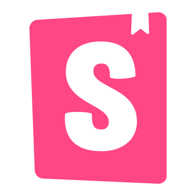
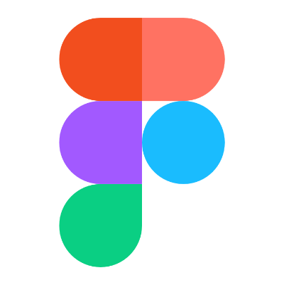
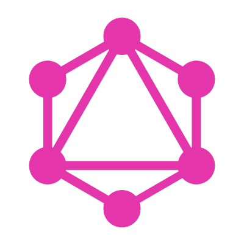
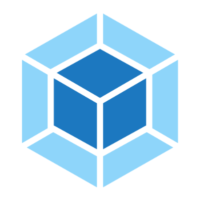
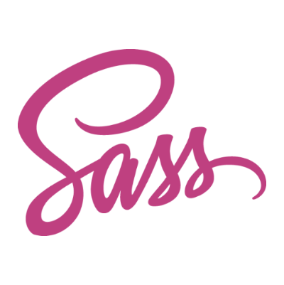
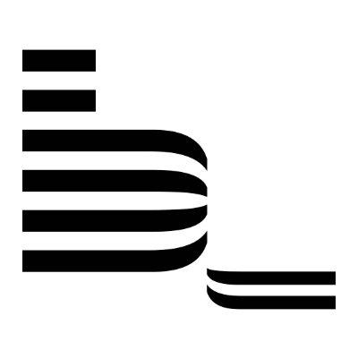
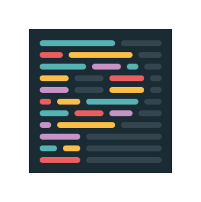
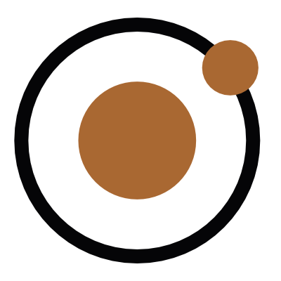

# nikkipantony.com

**Personal MVP website of Independent UI/UX Product Designer and Front-End Web Developer Nikki Pantony.**

 

_Deployed with Netlify, current status:_

 

<!-- Ally Design System Starter Kit Badge -->

    &nbsp;
    &nbsp;
    &nbsp;
    &nbsp;
    &nbsp;
    &nbsp;
    &nbsp;
    &nbsp;
    &nbsp;
    

_Built with the [Ally Design System Starter Kit](https://github.com/ally-design-system/ally-design-system-starter-kit) 💨_

<!-- / Ally Design System Starter Kit Badge -->
